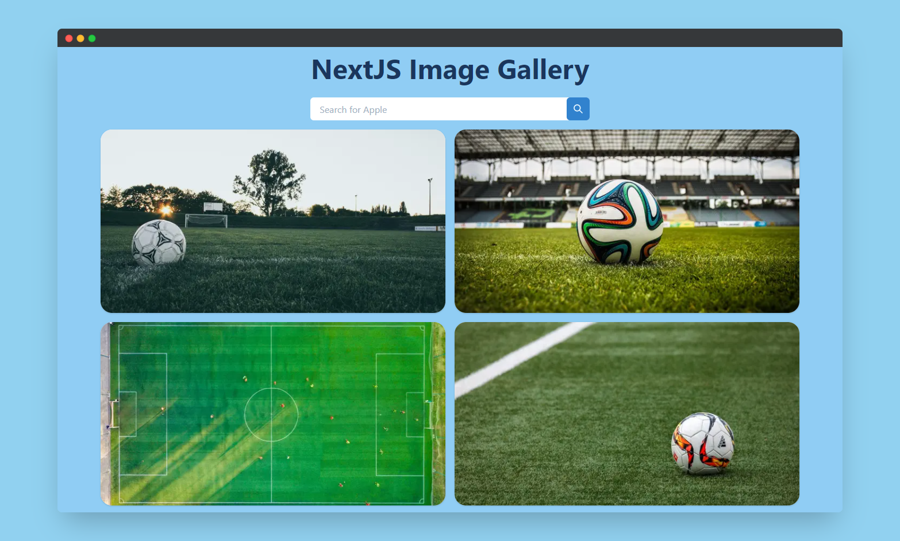

# NextJS Image Gallery



## Getting Started

1. Create file `.env.local` and get your apiKey for [pexels](https://www.pexels.com/)
2. Install all dependencies:

```bash
npm install
# or
yarn install
```

3. Run the development server:

```bash
npm run dev
# or
yarn dev
```

This is a [Next.js](https://nextjs.org/) project bootstrapped with [`create-next-app`](https://github.com/vercel/next.js/tree/canary/packages/create-next-app).

## Learn More

- [Chakra UI Documentation](https://chakra-ui.com/) - simple, modular and accessible component library.
- [Next.js Documentation](https://nextjs.org/docs) - learn about Next.js features and API.
- [Learn Next.js](https://nextjs.org/learn) - an interactive Next.js tutorial.
